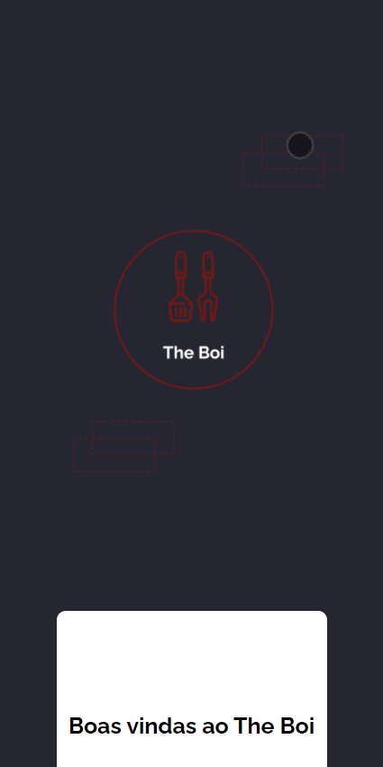
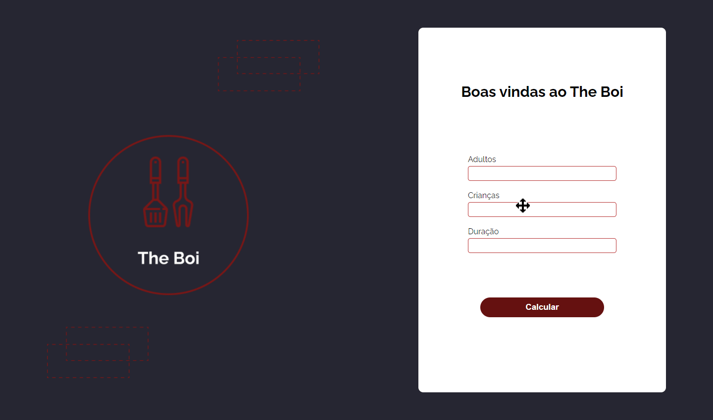

<h1 align="center">
    
     
     
    The Boi
</h1>

        

<h4 align="center">
    Projeto Churrascômetro desenvolvido para o curso do Programador BR, o objetivo é o usuário inserir as informações de quantas pessoas irão 
    para o churrasco e o tempo que ficarão. Depois o programa calcula o quanto de carne irão ter que levar, quantas latas de cerveja e refrigerante.
</h4>
 

     
    
    

#### 🚀 Tecnologias
 

### 📝 Licença
O projeto contém a licença MIT. Para mais informações acesse [LICENSE](https://github.com/tamirysnogueira/Horizon/blob/master/LICENSE).

 

Feito com 💖 por TamirysNogueira. [Get in Touch!](https://www.linkedin.com/in/tamirys-nogueira-346958205/)